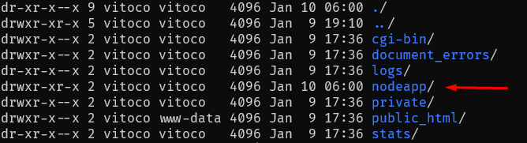
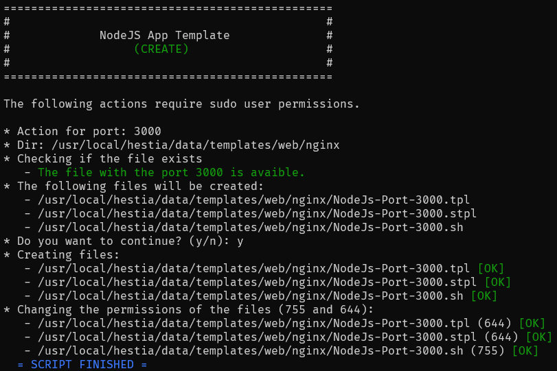

# HestiaCP with NodeJS Application

👍 [Version en Español](./spanish.md)

Running Node applications on HestiaCP can become a bit complicated, with this script you will create a template within HestiaCP that can be selected through the proxy templates within the domain configuration.


## How does it work?

It performs a `proxy pass` of all requests that come to the domain to the port on which the application runs, in addition creates a folder in the directory for storage of the application itself.



> At the moment no automatic script runs for the execution of the application, but the use of [PM2](https://pm2.keymetrics.io/) is recommended.

## How is it used?

You must clone this repository on the machine it will be used on. Once this is done, there are two methods, the manual method and the script method.

### The Script Method

The script must be executed with the permissions of the sudo user, since modifications will be made in folders with restricted access.

**1.-** We grant the permissions for the execution of the script

```bash
chmod +x ./create.sh
```

**2.-** Then we execute the script indicating the desired port.

```bash
sudo ./create.sh -p 3000
```

#### Options

| Option | Default                                      |                                                              |
| ------ | -------------------------------------------- | ------------------------------------------------------------ |
| -p     | `3000`                                       | Desired port.                                                |
| -d     | `/usr/local/hestia/data/templates/web/nginx` | Directory where templates will be created.                   |
| -f     | `nodeapp`                                    | Name of the directory that will be created within the domain to store the application files. |

#### Post execution



### Manual Method

**1.-** You must copy the 3 files that are located within the folder `files` within the folder where HestiaCP manages the templates for the domains that are created, in the path **`/usr/local/hestia/data/templates/web/nginx`**.

```bash
cp ./files/nodeapp.* /usr/local/hestia/data/templates/web/nginx/
```

**2.-** You must grant the permissions that each file requires

```bash
sudo chmod 644 nodeapp.tpl
```
```bash
sudo chmod 644 nodeapp.stpl
```
```bash
sudo chmod 755 nodeapp.sh
```

> The file is configured only for port 3000, if you want another port you must the `.tpl` and `.stpl` files by putting the desired port, in each file you must make two changes if you want to change the port.